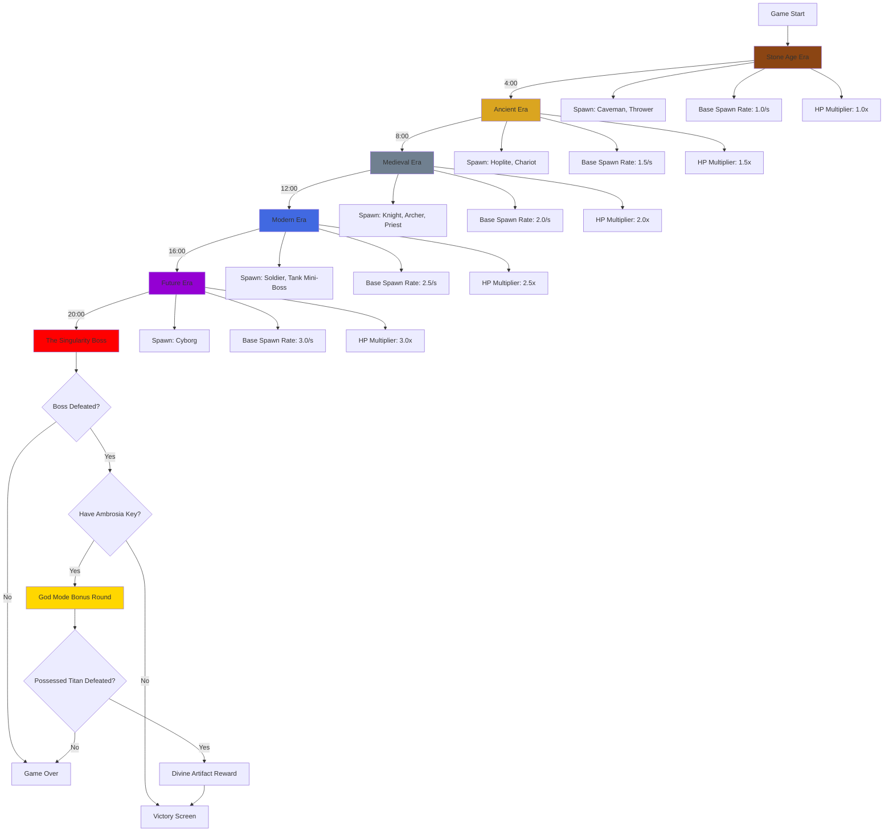
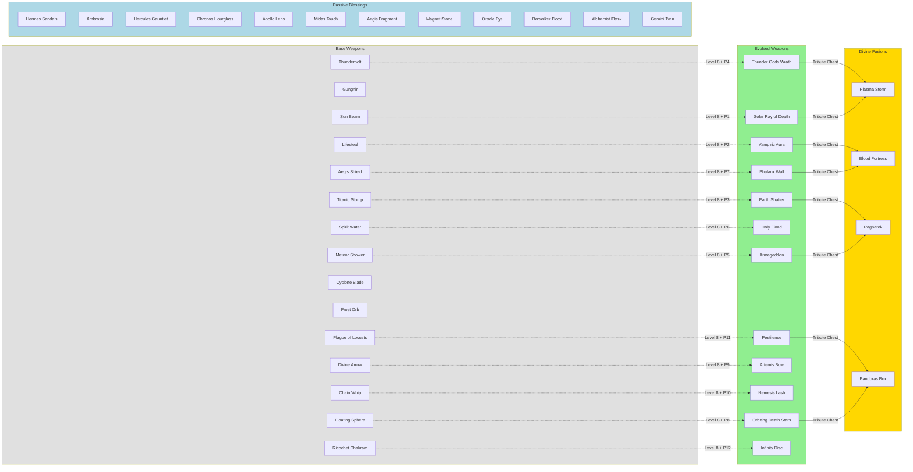
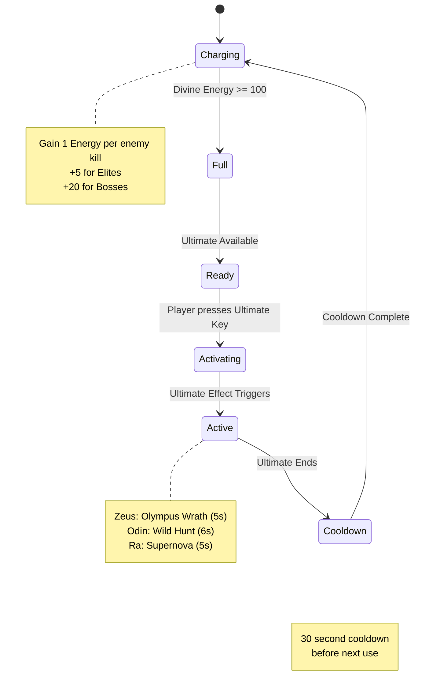

# Game Design Document: Gods vs Mortals (Complete)

**Version:** 2.0 (Comprehensive)
**Last Updated:** 2026-01-19
**Status:** Complete Specification

---

## Table of Contents

1. [High Concept](#1-high-concept)
2. [The Gods (Playable Characters)](#2-the-gods-playable-characters)
3. [Generic Arsenal (Shared Skills)](#3-generic-arsenal-shared-skills)
4. [Passive Support Skills & Evolution](#4-passive-support-skills--evolution)
5. [The Mortals (Enemy Progression)](#5-the-mortals-enemy-progression)
6. [Boss System & Bonus Round](#6-boss-system--bonus-round)
7. [Meta-Progression & Loot](#7-meta-progression--loot)
8. [Difficulty System](#8-difficulty-system)
9. [UI/UX Design](#9-uiux-design)
10. [Save System](#10-save-system)
11. [Technical Specifications](#11-technical-specifications)
12. [Asset Specifications](#12-asset-specifications)
13. [Accessibility Features](#13-accessibility-features)
14. [Achievement System](#14-achievement-system)
15. [System Diagrams](#15-system-diagrams)
16. [Implementation Roadmap](#16-implementation-roadmap)

---

## 1. High Concept

**Title:** Gods vs Mortals
**Genre:** Rogue-lite Survivor (Vampire Survivors style)
**Theme:** Mythological Gods fighting against the relentless march of humanity.
**Visual Style:** Cool, vibrant, cel-shaded "Cartoon" aesthetic. Low-poly 3D with punchy VFX.

**Core Loop:**
Select a God (Zeus/Odin/Ra) → Enter the Arena → Survive waves of Humans that technologically evolve over time → Upgrade Abilities → Unleash Divine Ultimates → Repeat.

**Match Duration Goal:** 20 Minutes.

---

## 2. The Gods (Playable Characters)

Each God has unique base stats, a passive trait, and a starting weapon/ability. As they level up, they can acquire abilities from their specific pool (or generic ones).

### 2.1 Zeus (Greek Pantheon) - The Thunder King

**Archetype:** High Burst Damage, Chain Attacks.

**Base Stats:**

- Max HP: 180
- Movement Speed: 5.5
- Damage Multiplier: 1.15
- XP Pickup Range: 50

**Passive: Static Charge**

- Charge Build: 1 charge per 2 units of distance moved
- Max Charge: 100
- Charge Decay: 5 charges per second when not moving
- Bonus Damage: 200% damage when fully charged
- Visual Indicator: Blue electrical aura around player, intensity based on charge level

**Starting Weapon: Thunderbolt**

- Damage: 25
- Projectile Speed: 20
- Fire Rate: 0.8 attacks/second
- Pierce Count: 3 enemies
- Cooldown: 1.25s
- Range: 15 units

**Unique Abilities:**

| Ability | Damage | Cooldown | Range/Area | Duration | Special |
|---------|--------|----------|------------|----------|---------|
| Chain Lightning | 15 per arc | 2.5s | 8 unit chain radius | Instant | Arcs 5 times, each arc deals 80% of previous |
| Thunderclap | 40 | 8s | 6 unit radius | 0.5s stun | Stuns all enemies in radius |
| Storm Cloud | 20 per strike | 12s | 4 unit radius | 10s | Drifts randomly, strikes every 1.5s |

**Ultimate: Olympus Wrath**

- Resource: Divine Energy (max 100)
- Cost: 100 Divine Energy
- Duration: 5 seconds
- Damage per Strike: 80
- Strike Interval: 0.5s
- Total Strikes: 10
- Strike Pattern: Random locations across screen, prioritizes enemy clusters

---

### 2.2 Odin (Norse Pantheon) - The All-Father

**Archetype:** Summoner, Wisdom (XP gain), Ranged Utility.

**Base Stats:**

- Max HP: 200
- Movement Speed: 5.0
- Damage Multiplier: 1.0
- XP Pickup Range: 75 (+50%)
- XP Gain: +10%

**Passive: All-Seeing Eye**

- XP Pickup Range: +50% (75 units total)
- XP Gain: +10% from all sources
- Visual Indicator: Golden glow around XP orbs, increased pickup range indicator

**Starting Weapon: Gungnir**

- Damage: 30
- Projectile Speed: 18 (out), 12 (return)
- Fire Rate: 0.7 attacks/second
- Pierce Count: 2 enemies (outbound), infinite on return
- Cooldown: 1.4s
- Range: 12 units (outbound)

**Unique Abilities:**

| Ability | Damage | Cooldown | Range/Area | Duration | Special |
|---------|--------|----------|------------|----------|---------|
| Raven Scouts | 8 per peck | 3s | 6 unit orbit radius | Permanent | 2 birds, peck every 0.8s |
| Rune Trap | 50 | 6s | 2 unit trigger radius | 30s duration | Places 3 traps, max 6 active |
| Wolves of War | 25 | 10s | Chase range 20 units | 15s | 2 wolves, chase nearest enemy |

**Ultimate: Wild Hunt**

- Resource: Divine Energy (max 100)
- Cost: 100 Divine Energy
- Duration: 6 seconds
- Damage per Rider: 100
- Rider Count: 5
- Rider Speed: 25
- Pattern: Sweep across screen from left to right, then right to left

---

### 2.3 Ra (Egyptian Pantheon) - The Sun God

**Archetype:** Area Consistency, DoT (Damage over Time), Defensive.

**Base Stats:**

- Max HP: 220
- Movement Speed: 4.8
- Damage Multiplier: 0.9
- Damage Reduction: 10%

**Passive: Solar Radiance**

- Burn Damage: 5 per second
- Radius: 4 units
- Visual Indicator: Orange/yellow aura, enemies in radius show burn effect

**Starting Weapon: Sun Beam**

- Damage: 15 per tick
- Tick Rate: 10 ticks/second
- Beam Width: 1 unit
- Range: 18 units
- Cooldown: None (continuous while holding)

**Unique Abilities:**

| Ability | Damage | Cooldown | Range/Area | Duration | Special |
|---------|--------|----------|------------|----------|---------|
| Solar Flare | 35 | 5s | 8 unit radius | 3s slow | Blinds (50% miss chance) + 30% slow |
| Obelisk | 20 per bolt | 15s | 15 unit range | 30s | Fires every 0.6s, max 2 active |
| Desert Heat | +50% burn damage | 8s | Passive buff | 15s | +50% burn duration |

**Ultimate: Supernova**

- Resource: Divine Energy (max 100)
- Cost: 100 Divine Energy
- Duration: 5 seconds
- Damage per Tick: 40
- Tick Rate: 8 ticks/second
- Radius: 10 units (expanding from 3 to 10 over 1s)
- Effects: Invulnerable, +200% movement speed, melts enemies

---

## 3. Generic Arsenal (Shared Skills)

In addition to the 4 starter kit spells (Shooting, Lifesteal, Floating Sphere, Spirit Water), the following new skills are available to **all Gods**:

| Ability | Damage | Cooldown | Range/Area | Duration | Special |
|---------|--------|----------|------------|----------|---------|
| Aegis Shield | 15 on contact | 0.5s rotation | 2 unit radius | Permanent | Blocks projectiles, 1 shield (upgradable) |
| Titanic Stomp | 45 | 10s | 6 unit radius | 0.3s knockback | Knocks back 5 units |
| Divine Arrow | 35 | 2s | 20 unit range | 3s lifetime | Seeks enemies, pierces 2 |
| Plague of Locusts | 3 per tick | 8s | Follows enemy | 6s | 20 locusts, 5 ticks/sec |
| Meteor Shower | 30 per meteor | 12s | 3 unit impact radius | Instant | 3 meteors, random locations |
| Cyclone Blade | 20 | 1.5s per blade | 4 unit orbit radius | 8s | 3 blades, orbit speed 2 rotations/sec |
| Frost Orb | 25 | 3s | 4 unit field radius | 4s slow | 40% slow, ice field persists |
| Chain Whip | 40 | 2.5s | 8 unit horizontal line | Instant | Hits all in line |
| Ricochet Chakram | 28 | 4s | 15 unit bounce range | 5s | Bounces 5 times |

---

## 4. Passive Support Skills & Evolution

In addition to active weapons, players can select **Passive Blessings**. These stats boost the player and **enable Weapon Evolutions**.

### 4.1 Passive Blessings

| Passive Name | Effect | Max Stacks | Evolves With... |
| :--- | :--- | :--- | :--- |
| **Hermes' Sandals** | +15% Movement Speed | 5 | Sun Beam → **Solar Ray of Death** |
| **Ambrosia** | +5 HP Recovery/sec, +20 Max HP | 5 | Lifesteal → **Vampiric Aura** |
| **Hercules' Gauntlet** | +10% Damage | 5 | Titanic Stomp → **Earth Shatter** |
| **Chronos' Hourglass** | -10% Cooldowns | 5 | Thunderbolt → **Thunder God's Wrath** |
| **Apollo's Lens** | +15% Area of Effect | 5 | Meteor Shower → **Armageddon** |
| **Midas' Touch** | +15% Gold/XP Gain | 5 | Spirit Water → **Holy Flood** |
| **Aegis Fragment** | +5 Armor (reduces damage by 5%) | 5 | Aegis Shield → **Phalanx Wall** |
| **Magnet Stone** | +20% Pickup Range | 5 | Floating Sphere → **Orbiting Death Stars** |
| **Oracle's Eye** | +5% Crit Chance (2x damage) | 5 | Divine Arrow → **Artemis' Bow** |
| **Berserker's Blood** | +10% Attack Speed | 5 | Chain Whip → **Nemesis Lash** |
| **Alchemist's Flask** | +20% Duration | 5 | Plague of Locusts → **Pestilence** |
| **Gemini Twin** | +1 Projectile | 3 | Ricochet Chakram → **Infinity Disc** |

### 4.2 Divine Evolution (Skill Merging)

**Mechanic:**

1. Level an **Active Weapon** to Max Level (8).
2. Have the matching **Passive Blessing** (Level 1+).
3. Open a **Tribute Chest** (dropped by Bosses/Elites).
4. **Result:** The weapon evolves into its "Superpowered" form (Tier 2).

### 4.3 Weapon Evolutions - Detailed Effects

| Base Weapon | Evolution Name | Changes |
|-------------|----------------|---------|
| **Sun Beam** | Solar Ray of Death | +100% damage, +50% beam width, +50% range, penetrates enemies |
| **Lifesteal** | Vampiric Aura | Becomes passive AoE, heals 5% of damage dealt to all enemies in 6 unit radius |
| **Titanic Stomp** | Earth Shatter | +150% damage, +100% radius, creates lingering damage field (10 damage/sec for 3s) |
| **Thunderbolt** | Thunder God's Wrath | +200% damage, +2 pierce, +50% speed, leaves electrified trail (15 damage/sec for 2s) |
| **Meteor Shower** | Armageddon | +100% damage, +2 meteors, meteors leave burning ground (20 damage/sec for 4s) |
| **Spirit Water** | Holy Flood | Creates expanding wave, +100% damage, pushes enemies back, heals player 20 HP |
| **Aegis Shield** | Phalanx Wall | +2 additional shields, shields rotate in formation, block threshold +50% |
| **Floating Sphere** | Orbiting Death Stars | +2 spheres, +100% damage, spheres explode on contact (30 AoE damage) |
| **Divine Arrow** | Artemis' Bow | Fires 3 arrows in spread, +50% damage per arrow, homing improved |
| **Chain Whip** | Nemesis Lash | +100% range, +50% damage, hits enemies in arc (180 degrees) |
| **Plague of Locusts** | Pestilence | +50% damage, locusts spread to nearby enemies on death, +50% duration |
| **Ricochet Chakram** | Infinity Disc | +3 bounces, +50% damage, bounces between enemies infinitely for 8s |

### 4.4 Tier 3: Divine Fusion (Artifacts)

**Mechanic:** Two specific **Evolved Weapons** (Tier 2) can be merged in a chest to create a **Godly Artifact** (Tier 3).

- **Benefits:** Frees up a weapon slot and provides game-breaking power.
- **Recipes:**
  - **Plasma Storm** = *Thunder God's Wrath* + *Solar Ray of Death*
  - **Blood Fortress** = *Vampiric Aura* + *Phalanx Wall*
  - **Ragnarok** = *Earth Shatter* + *Armageddon*
  - **Pandora's Box** = *Pestilence* + *Orbiting Death Stars*

#### Tier 3 Divine Fusions - Complete Mechanics

| Fusion Name | Components | Effect |
|-------------|------------|--------|
| **Plasma Storm** | Thunder God's Wrath + Solar Ray of Death | Creates a massive electrical storm that follows the player. Deals 50 damage/sec to all enemies in 12 unit radius. Strikes random enemies for 100 damage every 0.5s. Duration: 15s. |
| **Blood Fortress** | Vampiric Aura + Phalanx Wall | Creates a fortress of 6 rotating shields. Player gains 20% lifesteal on all damage. Shields reflect 50% of blocked damage back to attacker. |
| **Ragnarok** | Earth Shatter + Armageddon | Triggers a cataclysmic event. Every 2 seconds for 20s, a massive earthquake deals 80 damage to all enemies and creates 3 meteors that deal 100 damage each. |
| **Pandora's Box** | Pestilence + Orbiting Death Stars | Releases chaos. 5 explosive orbs orbit the player. When an orb expires, it releases a swarm of locusts that spread to nearby enemies. Each explosion deals 60 damage in 4 unit radius. |

---

## 5. The Mortals (Enemy Progression)

Instead of just random mobs, the enemies evolve through "Eras" as the match time progresses.

### 5.1 Era System

| Era | Time | Enemy Types | Behavior |
| :--- | :--- | :--- | :--- |
| **I. Stone Age** | 0:00 - 4:00 | **Cavemen**: Slow, high HP, melee clubs.<br>**Throwers**: Throw rocks (short range). | Swarm tactics, slow movement. |
| **II. Ancient Era** | 4:00 - 8:00 | **Hoplites**: Shielded (block first hit), spears.<br>**Chariots**: Fast charge attacks. | Formation movement, higher durability. |
| **III. Medieval Era** | 8:00 - 12:00 | **Knights**: Heavy armor (reduce phys damage).<br>**Archers**: Long range volley fire.<br>**Priests**: Heal other humans. | Balanced mix of range and melee. |
| **IV. Modern Era** | 12:00 - 16:00 | **Soldiers**: Auto-rifles.<br>**Tank (Mini-Boss @ 15:00)**: Drops "Divine Key". | Ranged dominance. |
| **V. Future Era** | 16:00 - 20:00 | **Cyborgs**: Shields.<br>**The Singularity (FINAL BOSS @ 20:00)**: Giant AI Core. | Bullet hell. |

### 5.2 Enemy Stats

**Base Scaling Formula:**

- Enemy HP = Base HP × (1 + (EraLevel × 0.5))
- Enemy Damage = Base Damage × (1 + (EraLevel × 0.3))
- Enemy Speed = Base Speed × (1 + (EraLevel × 0.1))

#### Stone Age (0:00 - 4:00)

| Enemy | HP | Damage | Speed | Attack Range | Attack Cooldown | Special |
|-------|----|--------|-------|--------------|-----------------|---------|
| Caveman | 50 | 10 | 2.0 | Melee (1.5) | 1.5s | None |
| Rock Thrower | 35 | 8 | 1.8 | 6 units | 2.0s | Throws rock (projectile) |

#### Ancient Era (4:00 - 8:00)

| Enemy | HP | Damage | Speed | Attack Range | Attack Cooldown | Special |
|-------|----|--------|-------|--------------|-----------------|---------|
| Hoplite | 80 | 15 | 2.2 | Melee (1.5) | 1.2s | Shield blocks first hit (20 HP shield) |
| Chariot | 100 | 25 | 4.5 | Charge (8) | 3.0s | Charge attack, knockback 3 units |

#### Medieval Era (8:00 - 12:00)

| Enemy | HP | Damage | Speed | Attack Range | Attack Cooldown | Special |
|-------|----|--------|-------|--------------|-----------------|---------|
| Knight | 120 | 20 | 2.0 | Melee (1.5) | 1.0s | 25% physical damage reduction |
| Archer | 50 | 12 | 2.5 | 15 units | 1.5s | Fires arrows, can hit from distance |
| Priest | 60 | 5 | 2.0 | 8 units | 2.0s | Heals nearby allies for 15 HP every 3s |

#### Modern Era (12:00 - 16:00)

| Enemy | HP | Damage | Speed | Attack Range | Attack Cooldown | Special |
|-------|----|--------|-------|--------------|-----------------|---------|
| Soldier | 90 | 18 | 2.8 | 12 units | 0.5s | Rapid fire (3 round burst) |
| Tank (Mini-Boss) | 500 | 40 | 1.5 | Melee (2.0) | 1.5s | Drops Ambrosia Key (100%) |

#### Future Era (16:00 - 20:00)

| Enemy | HP | Damage | Speed | Attack Range | Attack Cooldown | Special |
|-------|----|--------|-------|--------------|-----------------|---------|
| Cyborg | 150 | 25 | 3.0 | 10 units | 0.8s | Energy shield (50 HP, regenerates) |
| The Singularity (Final Boss) | 3000 | 60 | 1.0 | Screen-wide | Varies | Multiple attack patterns |

### 5.3 Spawn Rate Progression

| Era | Base Spawn Rate | Rate Increase per Minute |
|-----|-----------------|--------------------------|
| Stone Age | 1.0 enemies/sec | +0.1/sec |
| Ancient | 1.5 enemies/sec | +0.15/sec |
| Medieval | 2.0 enemies/sec | +0.2/sec |
| Modern | 2.5 enemies/sec | +0.25/sec |
| Future | 3.0 enemies/sec | +0.3/sec |

---

## 6. Boss System & Bonus Round

### 6.1 Mini-Bosses (Elites)

- **Spawn Times:** 4:00, 8:00, 12:00
- **HP Multiplier:** 3x base enemy HP
- **Damage Multiplier:** 2x base enemy damage
- **Size:** 1.5x normal size
- **Drops:** Tribute Chest (guaranteed)
- **Special:** Each has one unique ability based on era

### 6.2 The Singularity (Final Boss)

**Phase 1 (100% - 70% HP):**

- Pattern: Rotating laser beams
- Damage: 40 per second
- Warning: Laser paths shown before firing

**Phase 2 (70% - 40% HP):**

- Pattern: Homing missiles
- Damage: 50 per missile
- Count: 5 missiles, fired every 2s

**Phase 3 (40% - 0% HP):**

- Pattern: Bullet hell + laser beams
- Damage: 60 per hit
- Adds: Spawns 2 Cyborgs every 10s

### 6.3 "God Mode" (Bonus Round)

**Unlock Condition:** Defeat the Era IV Mini-Boss (Tank) to loot the **"Ambrosia Key"**.

**Mechanic:**

1. Defeat the Final Boss (The Singularity).
2. If holding the Key, the Boss does not die—it gets **Possessed** by Chaos.
3. **XP Piñata:** The Boss explodes, dropping massive amounts of XP (instant +20 Levels).
4. **GOD MODE ON:** Player cooldowns reduced by 80%, Damage +500%. Music shifts to heavy metal/epic orchestral.
5. **Titan Fight:** Fight the "Possessed Titan" for 2 minutes.

#### Possessed Titan (God Mode Boss)

- **HP:** 5000
- **Damage:** 100
- **Speed:** 3.0
- **Attack Pattern:**
  - Melee slam (6 unit radius, 80 damage, 2s cooldown)
  - Energy beam (20 damage/sec, 5s duration, 8s cooldown)
  - Summon minions (spawns 3 random enemies, 10s cooldown)
- **Defeat Reward:** Guaranteed Divine Artifact (Tier 3) for next run

---

## 7. Meta-Progression & Loot

### 7.1 Divine Mastery (XP)

Playing as a God earns "Worship" (XP). Higher Mastery levels unlock permanent base stat boosts.

**Mastery Levels:** 1-50 per God

**XP per Run:**

- Base: 100 Worship XP
- Per Minute Survived: +10 Worship XP
- Per Era Reached: +50 Worship XP
- Boss Defeated: +100 Worship XP
- Final Boss Defeated: +200 Worship XP

**Mastery Rewards:**

| Level Range | Reward |
|-------------|--------|
| 1-10 | +2 Max HP per level |
| 11-20 | +1% Damage per level |
| 21-30 | +0.5% Movement Speed per level |
| 31-40 | +1% XP Gain per level |
| 41-50 | +2% Ultimate Charge per level |

### 7.2 Loot System (Equipment)

Bosses and special "Tribute Chests" (random spawns) drop **Divine Relics** (Equipment).

**Slots:** Head, Body, Weapon Accessory, Relic.

**Rarity Tiers:**

| Rarity | Color | Drop Chance | Stat Range |
|--------|-------|-------------|------------|
| Common | Grey | 60% | 5-10% |
| Uncommon | Green | 25% | 10-20% |
| Rare | Blue | 10% | 20-35% |
| Epic | Purple | 4% | 35-50% |
| Divine | Gold | 1% | 50-75% |

**Inventory:**

- Max Slots: 50
- Can sell items for Gold (currency for future features)
- Items are God-specific or Global (50/50 split)

---

## 8. Difficulty System

### 8.1 Difficulty Modes

| Mode | Enemy HP | Enemy Damage | Spawn Rate | XP Gain | Unlock Condition |
|------|----------|--------------|------------|---------|------------------|
| Easy | 0.7x | 0.7x | 0.8x | 1.2x | Available from start |
| Normal | 1.0x | 1.0x | 1.0x | 1.0x | Available from start |
| Hard | 1.3x | 1.3x | 1.2x | 0.9x | Reach Mastery 10 with any God |
| Nightmare | 1.6x | 1.6x | 1.5x | 0.8x | Defeat Final Boss on Hard |

### 8.2 God Mode (Bonus Round) Modifiers

- **Damage:** +500%
- **Cooldown Reduction:** -80%
- **Duration:** 2 minutes (fixed)
- **XP Gain:** +20 levels instantly from boss explosion
- **Music:** Epic orchestral/metal mix

---

## 9. UI/UX Design

### 9.1 HUD Layout

```
┌─────────────────────────────────────────────────────────────┐
│  [Level: 5]              [Time: 03:45]              [Score] │
│                                                             │
│                                                             │
│                                                             │
│                                                             │
│                                                             │
│                    [Game View Area]                         │
│                                                             │
│                                                             │
│                                                             │
│                                                             │
│                                                             │
│  [Health: 180/200]    [XP: 45/100]    [Divine: 75/100]     │
│                                                             │
│  [Ability 1: ⚡] [Ability 2: ⚡] [Ability 3: ⚡] [Ult: ⚡]   │
└─────────────────────────────────────────────────────────────┘
```

### 9.2 Level-up Selection UI

- **Format:** 3 cards displayed horizontally
- **Card Content:**
  - Ability Name
  - Icon
  - Current Level / Max Level
  - Stat Changes (green for positive)
  - Description
- **Selection:** Click card or press 1/2/3

### 9.3 Character Select UI

- **Format:** Large portraits of each God
- **Information Panel:**
  - God Name
  - Archetype
  - Base Stats (HP, Speed, Damage)
  - Passive Ability (name + description)
  - Starting Weapon (name + description)
  - Mastery Level
- **Selection:** Click portrait or use arrow keys

---

## 10. Save System

### 10.1 Save Data Structure

```json
{
  "version": "1.0",
  "lastSaveTime": "2026-01-19T05:00:00Z",
  "gods": {
    "zeus": {
      "masteryLevel": 15,
      "worshipXP": 2500,
      "inventory": [
        {"id": "item_001", "rarity": "Rare", "equipped": false, "slot": "Head"},
        {"id": "item_002", "rarity": "Common", "equipped": true, "slot": "Body"}
      ],
      "unlockedAchievements": ["zeus_first_kill", "zeus_era2"]
    },
    "odin": {
      "masteryLevel": 8,
      "worshipXP": 1200,
      "inventory": [],
      "unlockedAchievements": []
    },
    "ra": {
      "masteryLevel": 3,
      "worshipXP": 400,
      "inventory": [],
      "unlockedAchievements": []
    }
  },
  "settings": {
    "graphics": {
      "quality": "High",
      "vsync": true,
      "fullscreen": false
    },
    "audio": {
      "masterVolume": 0.8,
      "musicVolume": 0.7,
      "sfxVolume": 0.9
    },
    "controls": {
      "moveUp": "W",
      "moveDown": "S",
      "moveLeft": "A",
      "moveRight": "D",
      "ultimate": "Space"
    }
  },
  "globalStats": {
    "totalRuns": 25,
    "totalKills": 15420,
    "totalTime": 12500,
    "highestLevel": 45,
    "bossesDefeated": 18
  }
}
```

### 10.2 Save Frequency

- **Auto-save:** After every run completion (death or victory)
- **Manual save:** Available from main menu
- **Save Slots:** 3 slots (Auto, Manual 1, Manual 2)

---

## 11. Technical Specifications

### 11.1 Performance Targets

| Target | Value |
|--------|-------|
| Target FPS | 60 |
| Minimum Acceptable FPS | 30 |
| Max Enemies on Screen | 200 |
| Max Projectiles on Screen | 100 |
| Target Load Time | < 3 seconds |

### 11.2 Platform Requirements

**PC (Minimum):**

- OS: Windows 10/11
- CPU: Intel i3-8100 / AMD Ryzen 3 1200
- RAM: 8 GB
- GPU: NVIDIA GTX 960 / AMD RX 570
- Storage: 2 GB available space

**PC (Recommended):**

- OS: Windows 10/11
- CPU: Intel i5-8400 / AMD Ryzen 5 2600
- RAM: 16 GB
- GPU: NVIDIA GTX 1060 / AMD RX 580
- Storage: 2 GB SSD

### 11.3 Godot Version

- **Target:** Godot 4.3+
- **Required Addons:**
  - godot-jolt (physics)
  - kaykit_characters (assets)
  - kaykit_dungeon_remastered (assets)
  - kaykit_skeleton_pack (assets)

---

## 12. Asset Specifications

### 12.1 Model Specs

| Asset Type | Poly Count | Texture Resolution |
|------------|------------|-------------------|
| Player (Gods) | 2000-3000 | 1024x1024 |
| Enemies | 1000-2000 | 512x512 |
| Bosses | 5000-8000 | 2048x2048 |
| Projectiles | 100-500 | 256x256 |
| Environment | 500-1000 per prop | 512x512 |

### 12.2 VFX Guidelines

- **Max Particles:** 500 per system
- **Particle Lifetime:** 0.5-3 seconds
- **Visual Clarity:** Enemies must remain visible through VFX
- **Color Coding:** Each God has distinct color scheme (Zeus: Blue/Yellow, Odin: Purple/Green, Ra: Orange/Red)

---

## 13. Accessibility Features

### 13.1 Colorblind Modes

- **Protanopia Support:** Red-Green colorblind adjustment
- **Deuteranopia Support:** Red-Green colorblind adjustment
- **Tritanopia Support:** Blue-Yellow colorblind adjustment
- **High Contrast Mode:** Increased contrast for all UI elements

### 13.2 Visual Aids

- **Damage Numbers:** Toggle on/off, adjustable size
- **Enemy Health Bars:** Toggle on/off for elites and bosses
- **Hit Indicators:** Screen flash on player damage
- **Projectile Highlights:** Enhanced visibility for enemy projectiles

### 13.3 Control Options

- **Full Remapping:** All keys/buttons can be remapped
- **Controller Presets:** Xbox, PlayStation, Switch layouts
- **Input Sensitivity:** Adjustable for analog sticks

---

## 14. Achievement System

### 14.1 General Achievements

- **First Blood** - Kill your first enemy
- **Survivor** - Survive for 5 minutes
- **Century** - Reach Level 100
- **God Slayer** - Defeat The Singularity

### 14.2 God-Specific Achievements

**Zeus:**

- **Thunderstruck** - Kill 100 enemies with Chain Lightning
- **Storm Master** - Reach Level 8 with Storm Cloud
- **Wrath of Olympus** - Use Olympus Wrath 10 times

**Odin:**

- **All-Seeing** - Collect 1000 XP orbs
- **Raven's Feast** - Kill 500 enemies with Raven Scouts
- **Wild Hunt** - Defeat 5 bosses using Wild Hunt

**Ra:**

- **Solar Flare** - Blind 50 enemies with Solar Flare
- **Desert King** - Survive the Future Era with Ra
- **Supernova** - Kill 100 enemies during a single Supernova

### 14.3 Challenge Achievements

- **Untouchable** - Complete a run without taking damage
- **Speed Demon** - Defeat The Singularity in under 15 minutes
- **Nightmare** - Defeat The Singularity on Nightmare difficulty
- **God Mode** - Defeat the Possessed Titan

---

## 15. System Diagrams

### 15.1 Era Progression System



### 15.2 Weapon Evolution System



### 15.3 Divine Energy (Ultimate) System



---

## 16. Implementation Roadmap

### 16.1 Phase 1: Foundation & Cleanup

1. **Project Review**: Analyze `GameManager`, `EnemySpawner`, and `Player` classes.
2. **Tagging**: Establish Tag/Layer system for `Player`, `Enemy`, `Projectile`.
3. **Input**: Ensure WASD/Controller support is smooth.

### 16.2 Phase 2: The Era System

1. **EraManager Class**: A new script to track `GameTime` and state `CurrentEra`.
2. **Spawn Pools**: Create cleaner `Resource` based spawn pools for each Era.
3. **Spawner Update**: Modify `EnemySpawner` to subscribe to `EraManager`.

### 16.3 Phase 3: Character System (The Gods)

1. **GodProfile Resource**: Holds BaseStats, StartingWeaponPrefab, PassiveEffectScript.
2. **Character Select Screen**: Simple UI to pick a God before loading the main scene.
3. **Asset Integration**: Replace the default capsule player with God placeholders.

### 16.4 Phase 4: Ability Creation

1. **Weapon System**: Implement the 9+ unique abilities + 3 ultimates.
2. **Ultimate Mechanic**: Add Divine Energy bar that fills on kills.
3. **Evolution System**: Implement Tier 2 and Tier 3 weapon evolution logic.

### 16.5 Phase 5: Art & Juice

1. **Shader**: Implement a "Toon Shader" for all 3D models.
2. **VFX**: Particle effects for abilities, enemies, and UI.
3. **Animation**: Squash and stretch on hit, exaggerated death animations.

### 16.6 Phase 6: UI/UX Implementation

1. **HUD**: Implement health, XP, Divine Energy bars, ability icons.
2. **Level-up UI**: 3-card selection system.
3. **Character Select**: God portraits and info panel.
4. **Inventory UI**: Equipment management screen.

### 16.7 Phase 7: Save System

1. **Save Data Structure**: Implement JSON serialization.
2. **Auto-save**: Save after each run completion.
3. **Load System**: Load mastery levels and inventory on startup.

### 16.8 Phase 8: Polish & Balance

1. **Difficulty Modes**: Implement Easy/Normal/Hard/Nightmare.
2. **Balance Tuning**: Adjust ability damage, enemy stats, spawn rates.
3. **Accessibility**: Add colorblind modes, visual aids, control remapping.

---

## Appendix A: Code Structure Reference

### A.1 EraManager Specification

```csharp
public enum Era
{
    StoneAge,      // 0:00 - 4:00
    Ancient,       // 4:00 - 8:00
    Medieval,      // 8:00 - 12:00
    Modern,        // 12:00 - 16:00
    Future         // 16:00 - 20:00
}

public class EraDefinition : Resource
{
    [Export] public Era EraType;
    [Export] public float StartTime;
    [Export] public float EndTime;
    [Export] public Godot.Collections.Array<EnemyClass> EnemyPool;
    [Export] public float SpawnRateMultiplier;
    [Export] public float EnemyHealthMultiplier;
    [Export] public float EnemyDamageMultiplier;
    [Export] public float EnemySpeedMultiplier;
}
```

### A.2 GodProfile Structure

```csharp
public class GodProfile : Resource
{
    [Export] public string GodName;
    [Export] public string Pantheon;
    [Export] public string Archetype;
    [Export] public GodStats BaseStats;
    [Export] public PassiveAbility StartingPassive;
    [Export] public Weapon StartingWeapon;
    [Export] public Godot.Collections.Array<Weapon> UniqueAbilities;
    [Export] public UltimateAbility Ultimate;
}

public class GodStats
{
    public uint MaxHP;
    public float MovementSpeed;
    public float DamageMultiplier;
    public float XPRange;
    public float DamageReduction;
}
```

---

## Appendix B: Directory Structure

```
res://
  ├── _Game/
  │   ├── Characters/
  │   │   ├── Gods/
  │   │   │   ├── Zeus/
  │   │   │   ├── Odin/
  │   │   │   └── Ra/
  │   │   └── Enemies/
  │   │       ├── StoneAge/
  │   │       ├── Ancient/
  │   │       └── ...
  │   ├── Systems/
  │   │   ├── Spawning/
  │   │   │   ├── EraManager.cs
  │   │   │   └── EraDefinition.tres
  │   │   ├── Abilities/
  │   │   ├── SaveSystem/
  │   │   └── UI/
  │   ├── UI/
  │   └── Maps/
  └── _Assets/
      ├── Models/
      ├── Shaders/
      └── Audio/
```

---

**Document Version:** 2.0
**Last Updated:** 2026-01-19
**Status:** Complete Specification Ready for Implementation
