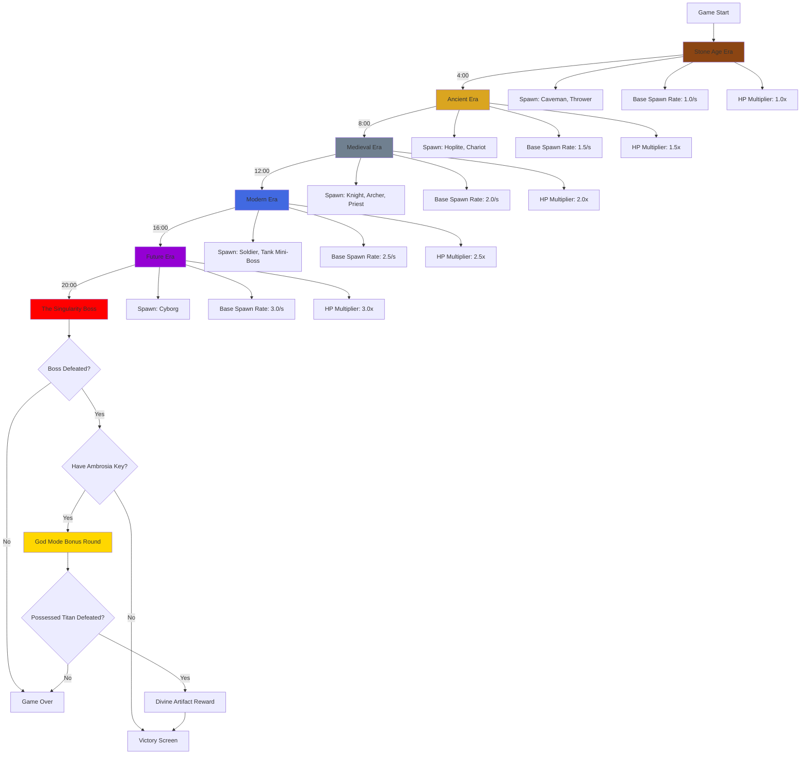
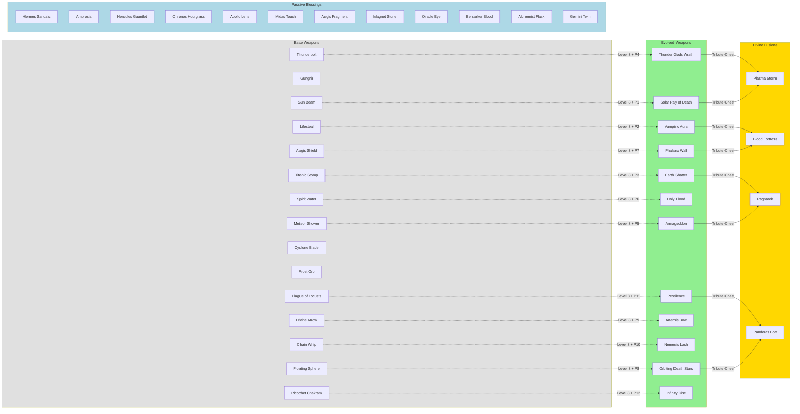
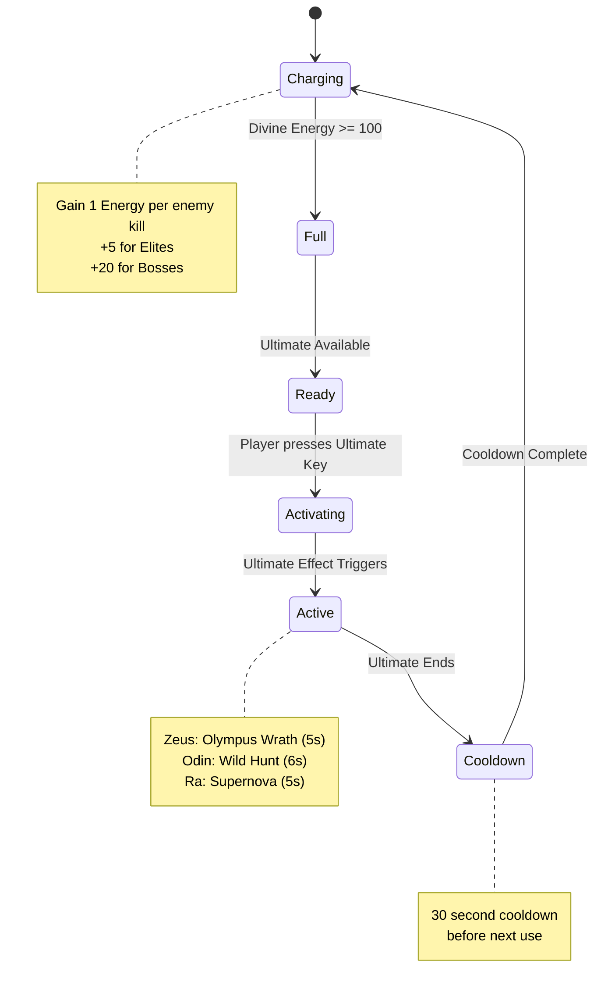
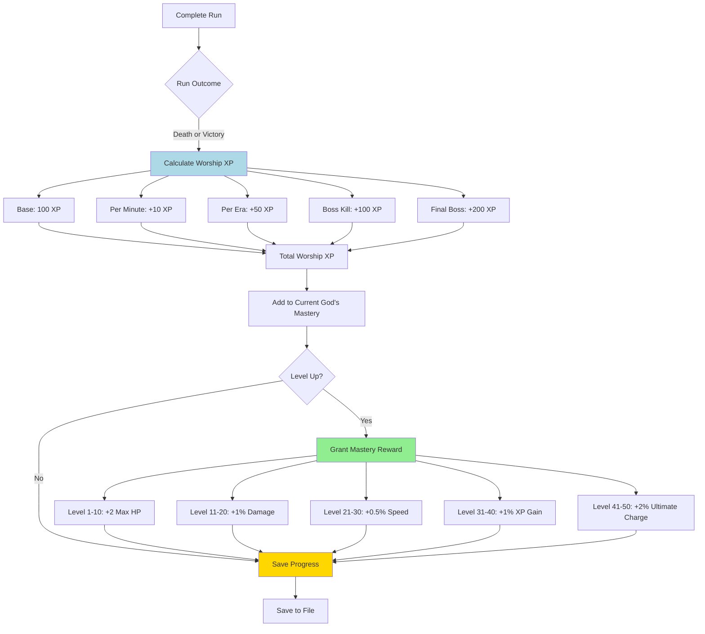
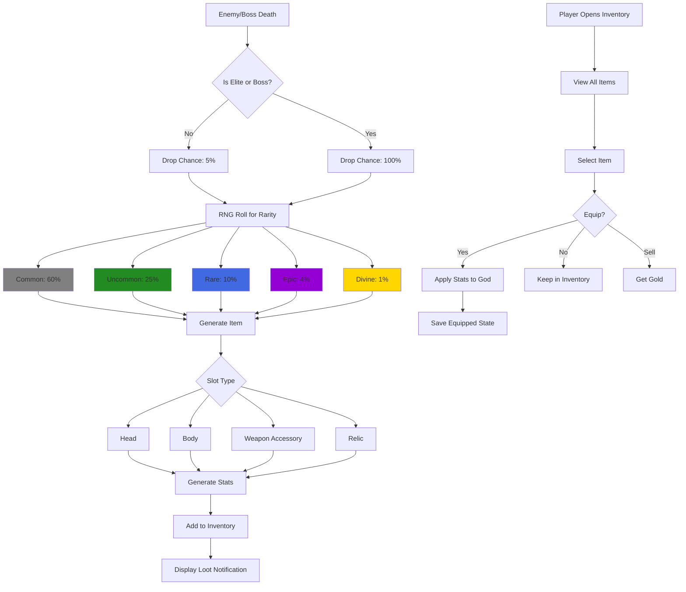
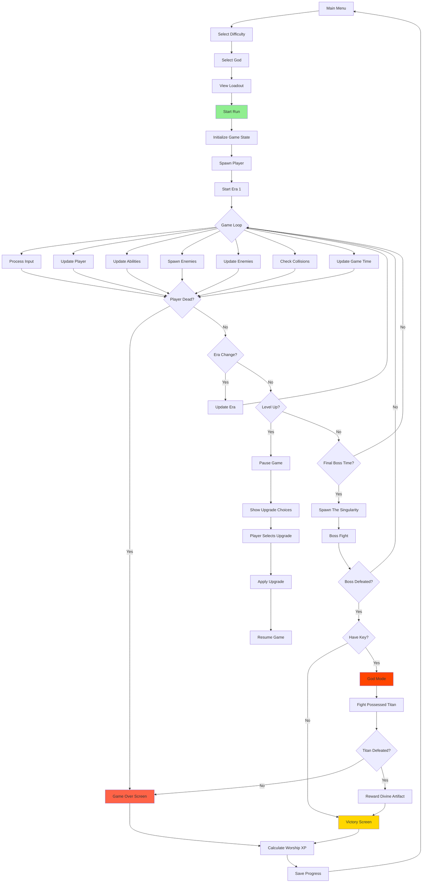
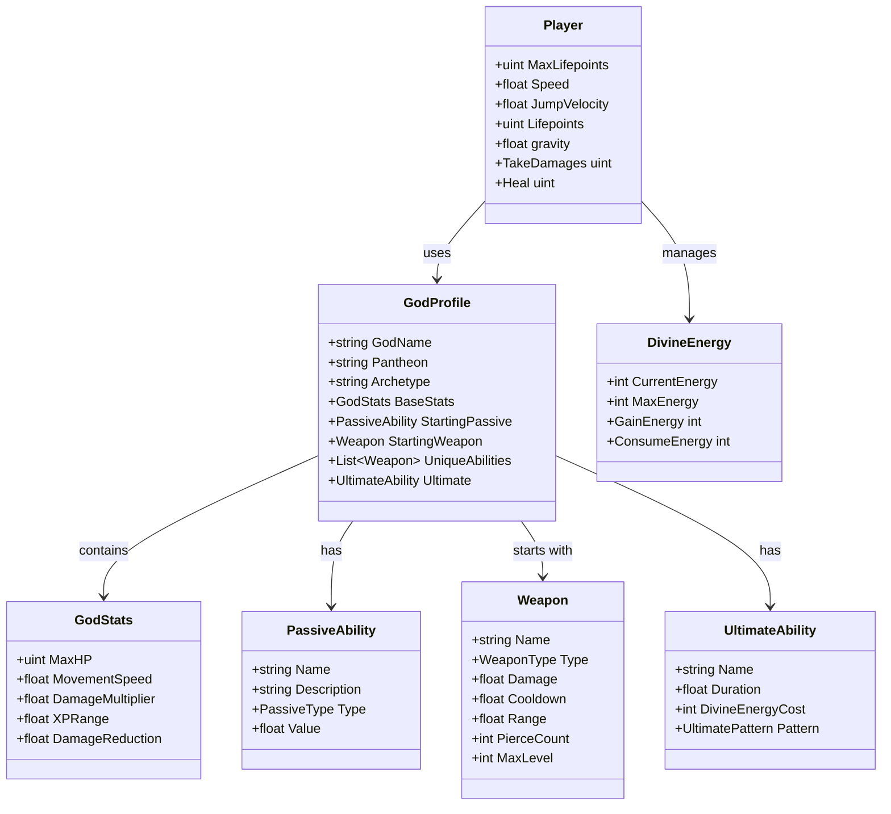
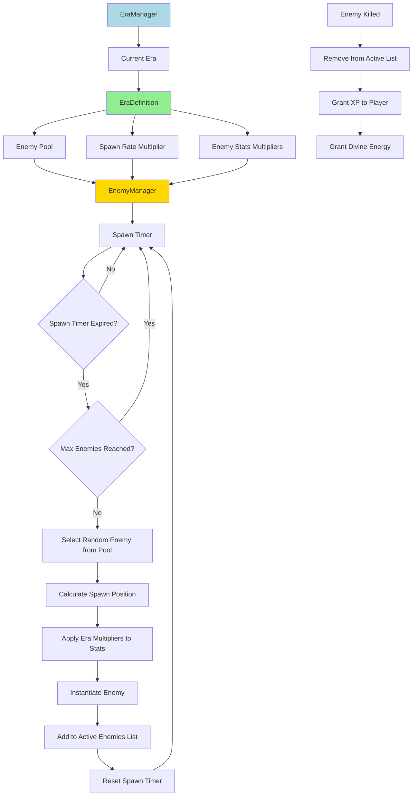
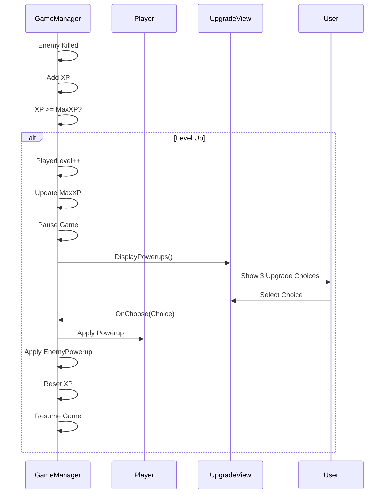
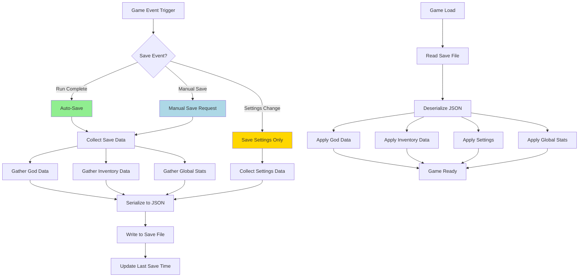

# GDD System Diagrams: Gods vs Mortals

## Overview

This document contains visual diagrams for the complex systems in "Gods vs Mortals" using Mermaid syntax.

---

## Diagram 1: Era Progression System

---

## Diagram 2: Weapon Evolution System

---

## Diagram 3: Divine Energy (Ultimate) System

---

## Diagram 4: Meta-Progression (Mastery) System

---

## Diagram 5: Equipment & Loot System

---

## Diagram 6: Game Loop Flow

---

## Diagram 7: God Character System Architecture

---

## Diagram 8: Enemy Spawning System

---

## Diagram 9: Level-Up Upgrade System

---

## Diagram 10: Save System Flow

---

*Document Version: 1.0*
*Last Updated: 2026-01-19*
